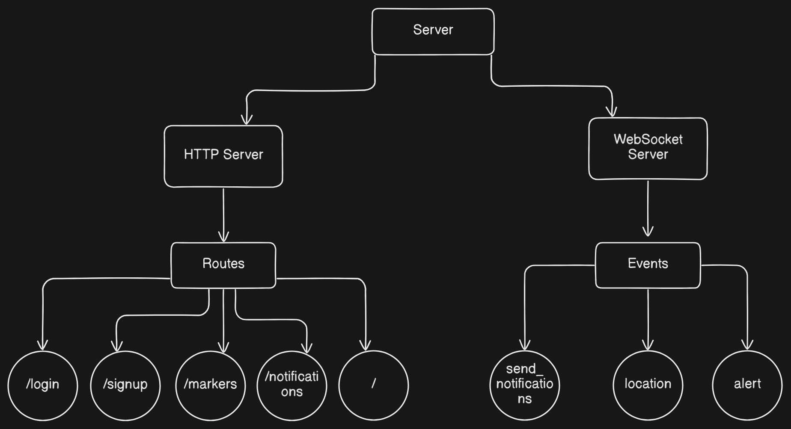
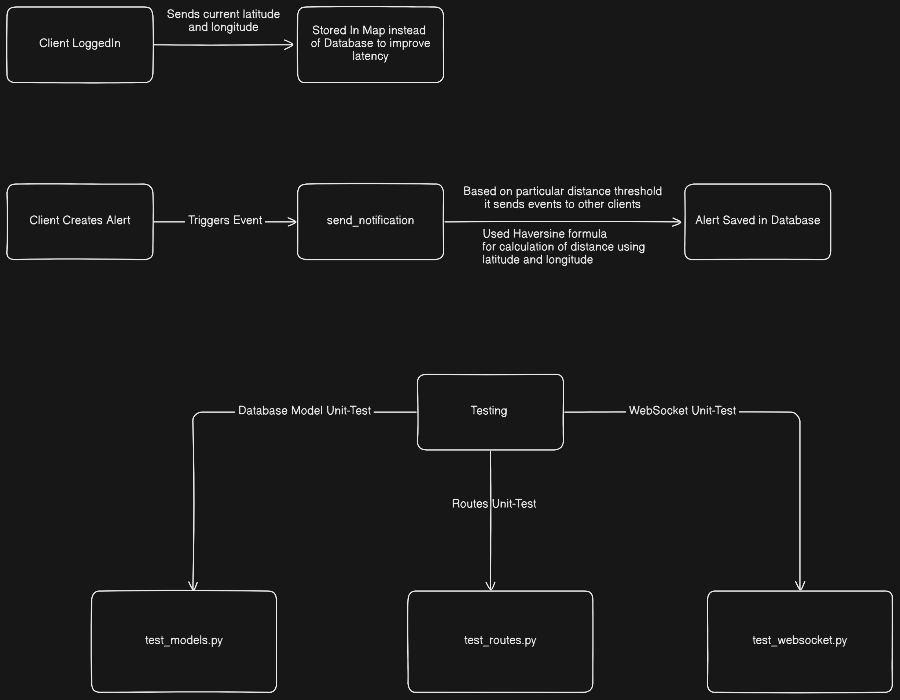
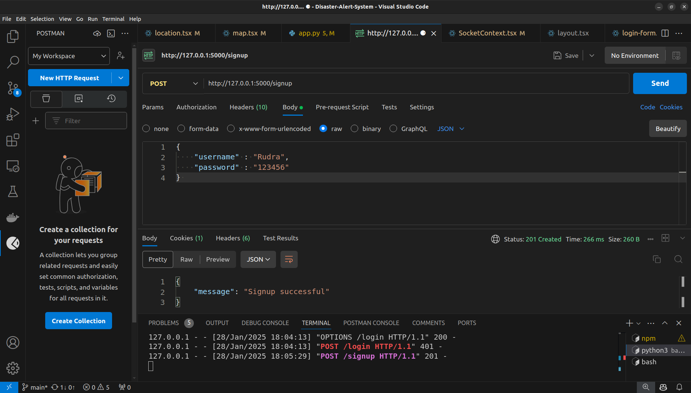
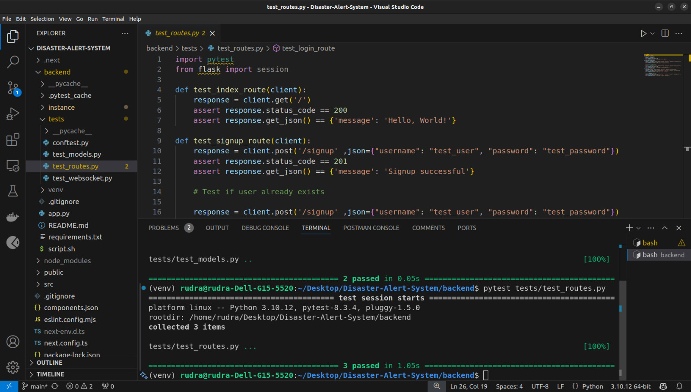
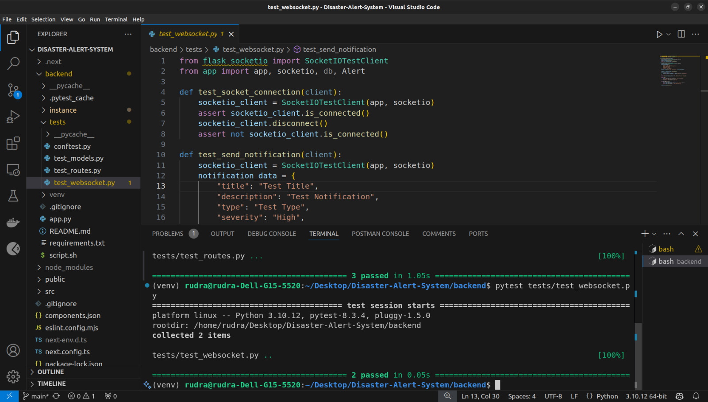
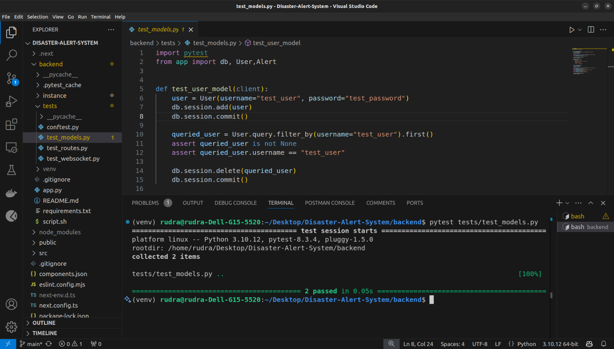
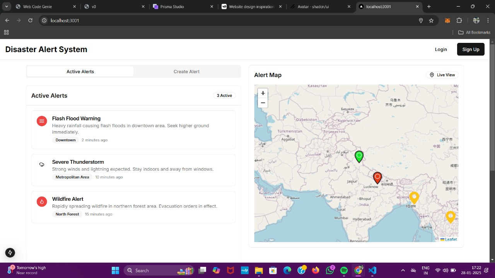
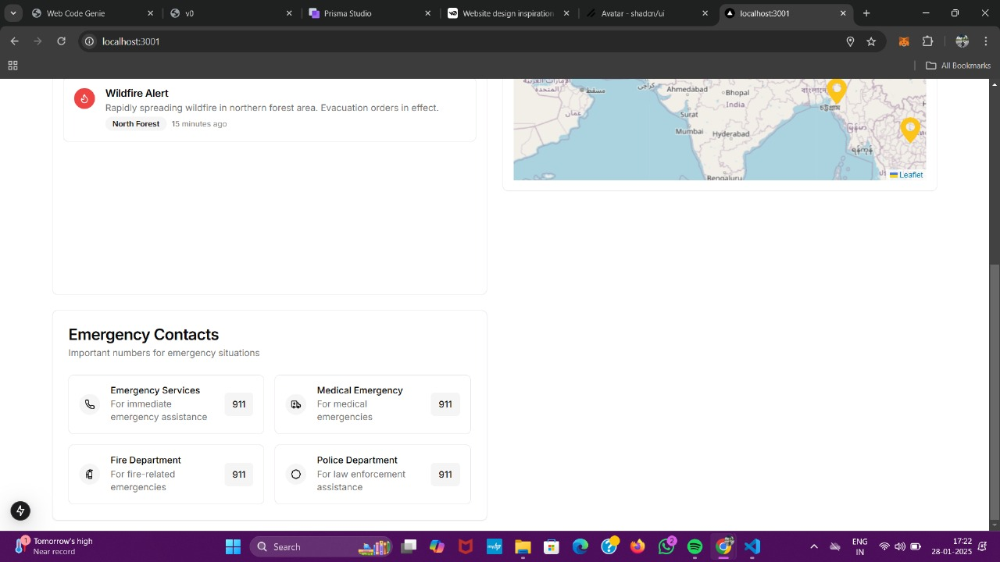
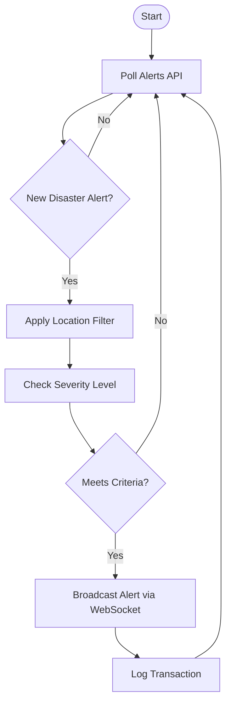

# Disaster Alert System 🌍🚨  
**College:** Indian Institute of Technology (IIT) Mandi <br>
**Academic Year:** 2025-2026 <br>
**Mentor:** Prof. Varun Datt


## System Architecture

<br><br>

---

## 👥 Team Members
| Name                | Role                |
|---------------------|---------------------|
| Rudra Pratap Singh  | Documentation Specialist       |
| Sushant Wayal       | Frontend Developer  |
| Rudra Pratap        | Backend Developer & Tester   |
| Shivam Jaiswal      | Project Manager          |
| Ritam Dutta         | Quality Assurance Engineer   |
| Badal Mandal         | Requirements Engineer  |


## 📁 Table of Contents
1. [Project Overview](#project-overview)
2. [Features](#features)
3. [Screenshots](#screenshots)
4. [Workflow](#system-workflow)
5. [Installation](#installation)
6. [Configuration](#configuration)
7. [Usage](#usage)

## 📌 Project Overview
The Disaster Alert System is a Flask-based application designed to provide real-time alerts and notifications for disaster management. It supports user authentication, alert creation, and broadcasting notifications to connected clients via WebSocket communication.

---

**Key Objectives:**
- Real-time alerts for natural disasters
- Configurable alert thresholds
- Location-based filtering
- Reliable notification system

## ✨ Features
- **Core Functionality**
  - 24/7 disaster monitoring
  - Alerts (WebSocket)
  - Geographic filtering (Lat/Long)
  - Support for 5+ disaster types

- **Technical Components**
  - REST API integration
  - Environment-based configuration
  - Automated cron scheduling
  - Detailed logging system

## 📸 Screenshots
| Component          | Preview             |
|--------------------|---------------------|
| API Response       |  |
| Testing            |    |
| System Dashboard   |    |

## 🔄 System Workflow


## 💻 Installation
### Prerequisites
- Python 3.8+
- Flask
- Flask-SocketIO

```bash
# Clone repository
git clone https://github.com/sushant-wayal/Disaster-Alert-System.git
cd Disaster-Alert-System

# Create virtual environment
python -m venv venv
source venv/bin/activate  # Windows: venv\Scripts\activate

# Install dependencies
pip install -r requirements.txt
```

## ⚙️ Configuration
1. Create .env file:
```bash
SECRET_KEY=your_secret_key
DATABASE_URI=sqlite:///disaster_alert.db
SOCKETIO_MESSAGE_QUEUE=redis://localhost:6379
```

2. Configure settings.yaml:
```yaml
location:
  latitude: 18.5204
  longitude: 73.8567
  radius: 100  # km

alert_preferences:
  severity: [High, Severe]
  disasters: [Earthquake, Flood]
```

## 🚀 Usage
### Basic Command
```bash
python app.py
```

### Testing
Run tests using pytest:
```bash
pytest
```

### Scheduled Execution
```bash
# Run every 5 minutes
*/5 * * * * cd /path/to/project && venv/bin/python app.py
```
